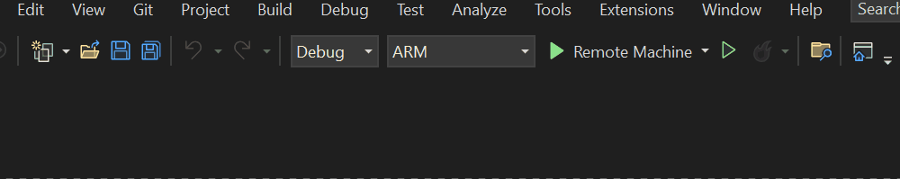

# **Setup**

### **Enable Developer Mode on HoloLens 2**

- Turn on your HoloLens 2 and navigate to Settings > Updates > For Developers
- Enable Use Developer Features in order to deploy applications from Visual Studio  
    
- We recommend to enable Windows Device Portal in this menu too (https://docs.microsoft.com/en-us/windows/mixed-reality/develop/advanced-concepts/using-the-windows-device-portal)

&nbsp;

### **Enable Developer Mode on your PC**

- Navigate to Settings > Updates and Security > For Developers
- Enable Developer Mode and click Yes to accept the change  
    

### **Install and run the compiled app**

- Download Sjør_v1.0.2.0_ARM64.zip from the Compiled/ directory
- Unpack to your local machine
- Open Windows Device Portal > Views > Apps > Local Storage > Browse > Navigate to unpacked folder > ar-coastal-sailing_1.0.2.0_ARM64.appx  
    [Here are detailed instructions](https://learn.microsoft.com/en-us/windows/mixed-reality/develop/advanced-concepts/using-the-windows-device-portal#sideloading-applications) for installing an application via Windows Device Portal

&nbsp;

# Development

## Start Developing

Development was done with the mentioned software versions. Later/other versions are untested but might also work.

**Prerequisites**

- Unity 2020.3.47f1
- Mixed Reality Toolkit 2.8.3 (included in the project)
- Visual Studio 2019 (16.3) or Visual Studio 2022

*Include in Visual Studio installation*

- Desktop development with C++
    
- Universal Windows Platform (UWP) development
    
- On Windows 10 : Windows 10 SDK version 10.0.19041.0 or 10.0.18362.0  
    On Windows 11: Windows 11 SDK version 10.0.22621.0
    
- USB Device Connectivity (required to deploy/debug to HoloLens over USB)
    
- C++ (v142) Universal Windows Platform tools (required when using Unity)
    
- Git (optional to download the project)
    

&nbsp;

**Get the project up and running**

- Clone the project in a directory using git clone
    
- Create an account and API key for barentswatch (the API used for retrieving vessel data):
    


- - Go to https://www.barentswatch.no/minside/
        
        ```
        - Create an account
        - Create a client below "Mine klienter"
        - Create a json-file in the Unity project folder Assets/Resources/Config/ named barentswatch_conf.json with the following content, where you replace the example data with the credentials from Barentswatch. Remember or copy the client secret when creating a new client, since you won't be able to view or edit the password afterwards
        ```
        

`{ "token_url": "https://id.barentswatch.no/connect/token", "ais_url": "https://www.barentswatch.no/bwapi/v2/geodata/ais/openpositions?Xmin={0}&Xmax={1}&Ymin={2}&Ymax={3}", "auth_format": "client_id={0}&scope=api&client_secret={1}&grant_type=client_credentials", "client_id": "ali%40example.com%3ASjoerTest-1", "client_secret": "1234567891234" }`

Find out more about [barentswatch_conf.json](../DOCUMENTATION/Scripts&Functions/barentswatch_conf.json.md) file here

- Open the project in Unity
- Go to File > Build Settings  
    • Make sure the settings match the ones below:


&nbsp;

## Building Unity project & compiling with Visual Studio

*The remaining checkboxes should be deselected when creating a release build*

Note: The build process creates a solution (.sln) Visual Studio project file. Open this with Visual Studio, connect the HoloLens and adjust the project settings to compile the application. It can either be automatically copied to the HoloLens after compilation or otherwise you will have to follow the steps for manually installing the app with the Windows Device Portal.

- Click Build
    
- Select a folder where the project should be built to
    
- Go into the export folder and open the Visual Studio project by double-clicking ar-coastal-sailing.sln
    
- Now connect the HoloLens 2 to your PC using USB and wait until Windows recognizes it. You should hear audio feedback when successfully connected, if system sounds are enabled on your PC  
    *Note: Sometimes the HoloLens 2 might not be recognized by the PC, although it might have worked before. In those cases you can:*
    
    - *disconnect and plugin again*
    - *toggle Developer Mode off an on in the HoloLens settings*
    - *try another cable (USB-C cables look similar but can be quite different internally)*
- In Visual Studio, switch Debug to Release, ARM to ARM64 and Remote Device to Device (by clicking the small arrow on the right side of ARM)
    
- Then click the Debug tab on top of Visual Studio and select Start without debugging
    



*The project is now being build and compiled for HoloLens. This will take around 5-10 minutes, depending on your system. Leave the HoloLens plugged into your PC until it makes a sound and the project is opened automatically. If you see an error complaining about "Failed to connect to device ...." the device is either not recognized by your PC or you did not enable Developer Mode (either on PC or HoloLens). If you cannot fix connecting to the device, you can also try to only compile and manually install the compiled application via Windows Device Portal.*

&nbsp;

&nbsp;

**Connect to GPS on your phone**

In order to receive your current GPS position you will need to connect the HoloLens with a GPS server hosted on your phone. You can either create a mobile hotspot with your phone and simply connect the HoloLens to that WIFI hotspot, or use a WIFI router and connect both, your phone and the HoloLens to it. Some WIFIs, such as Eduroam, might be tricky and not work. Always fallback to phone hotspot when encountering problems.

On the phone you need to run an app for hosting a local server that broadcasts the current GPS information via the local network (WIFI or hotspot). This project used the NetGPS app, but could potentially be adapted to others.

- [Download the NetGPS Android app in PlayStore](https://play.google.com/store/apps/details?id=com.meowsbox.netgps&hl=en&gl=US)
- Disconnect your phone from WiFi and create a hotspot with your phone and connect the HoloLens to it

*Note that this will use mobile data (but it should not be a crazy amount)*

- In NetGPS, open the second tab and create and enable a server with *type: TCP*, *port: 6000*
- Then click the arrow on top to show your IP address
- Insert the IP address from the app at wlan0 into the config file in the Unity project at Assets/Resources/Config/conf.json (at the bottom of the file). You can also edit the IP address during runtime via the handbased UI on the HoloLens, but you will have to restart the HoloLens application afterwards, since it connects to the GPS IP on start
- If we now run the application on the HoloLens, it should connect to the phone

&nbsp;

&nbsp;
