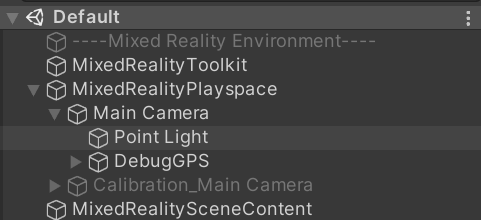
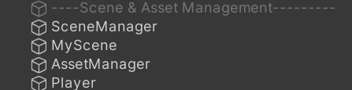

# Mixed Reality Environment

- The Mixed Reality (MR) settings that are necessary to set up HoloLense 2 in a Unity scene.
- The MainCamera exists within the Playspace and contains the custom *DebugGPS* object, which is attached to the head Transform. It is an overhead display for debugging the incoming GPS commands.
- If calibration is activated within the same scene (1-scene-calibration), the *Calibration_Main Camera* is used during the calibration process.

&nbsp;

# Scene & Asset Management

- `SceneManager` is a script that was implemented during 2-scene-calibration, and is therefore currently not relevant for the current state.
    
- `MyScene` has the DefaultScene script attached to it, which handles the basic scene initialization and a public reference to the Player script.
    
    - On Start it
        - assigns the \[Player script\]([Player Singleton](:/dc1b534a3d4244cea0f10cf7901b8738))
        - assigns itself to the GraphicFactory
        - creates two [infoCategories](../DOCUMENTATION/Scripts&Functions/Info%20Category.md): AISHorizon (ConnectedInfoCategory) and AISSky (InjectedInfoCategory)
    - On Update foreach infoCategory
        - RetrieveInfoItems()
        - set InfoItem List to both Graphics [Post Processor](../DOCUMENTATION/Scripts&Functions/Post%20Processor.md)
        - update marker PinList from AISHorizon-category, for multiplayer marking capability
- `AssetManager` is basically a Singleton for holding the config files and infoItem Pin-prefabs. Late additions to the project focused more on dynamic configurations that can be overwritten by the user on each HoloLens device separately and were therefore implemented with Unity's PlayerPrefs system. To avoid tempering with the previous config-file system, these PlayerPref's initial values are taken from the config-file but can be overwritten during runtime.
    
    - [conf.json](../DOCUMENTATION/Scripts&Functions/conf.json.md)
    - [barentswatch_conf.json](../DOCUMENTATION/Scripts&Functions/barentswatch_conf.json.md)
- Player

&nbsp;

&nbsp;