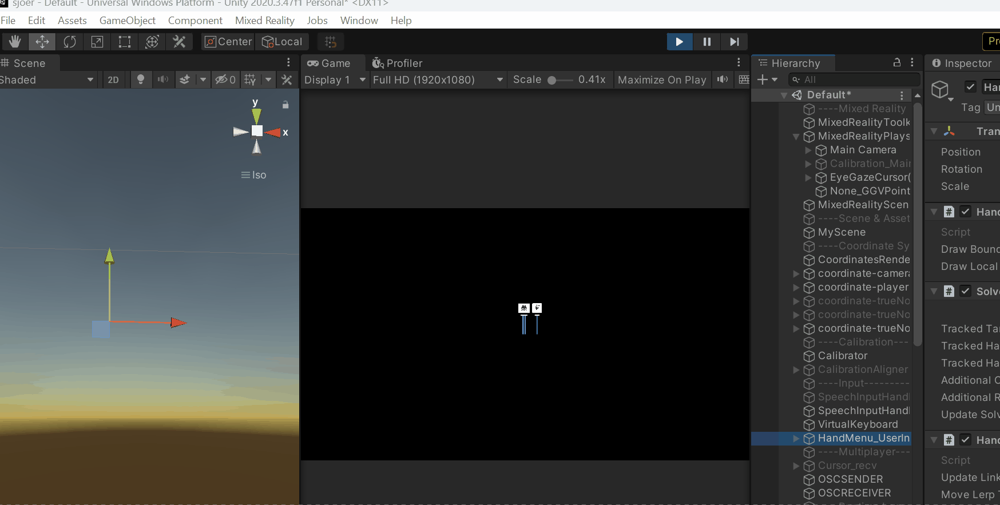
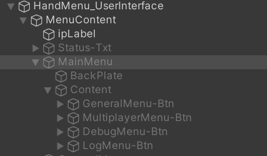

# HandMenu-UserInterface (HandMenu-UI)

&nbsp;

## Interacting with the UI in the Unity Editor

Familiarize yourself with how to handle the MRTK HoloLens input simulation, you can [find instructions here](https://learn.microsoft.com/en-us/windows/mixed-reality/mrtk-unity/mrtk2/features/input-simulation/input-simulation-service?view=mrtkunity-2022-05#how-to-use-mrtk-input-simulation).

Start PlayMode, select the *HandMenu_UserInterface* GameObject in the inspector and activate its child object called *MenuContent*. You will now see the initial user interface. Hit the space key to show the virtual hand and use the mouse  / scroll wheel make the hand hover over the UI. Setup the multiplayer connection if you want, or click on the Back-button otherwise.

The UI has the following structure:

Main menu

- General:
    - EyeTracking mode:  
        when enabled, the user can select vessel pins by focusing on them with their eyes; turned off by default
    - GPS connection setup:  
        edit the configuration for IP address to retrieve the GPS from. Initially the IP for the phone GPS is defined in the *conf.json* file (Assets > Resources > Config), but since this configuration is baked into the built application, the value can be reconfigured during runtime and stored in the [PlayerPrefs](https://docs.unity3d.com/ScriptReference/PlayerPrefs.html) data.
    - vessel settings:  
        \- set the name of your vessel (the one you are currently on during real-world use), so that this vessel's pin is skipped when displaying (otherwise it will occlude other pins)   
        \- set the height of your vessel  
        \- set the area size (in m²) that you want to retrieve API data from
    - night mode:  
        toggle the brightness of graphic elements to adjust scene to darker environments
- MultiplayerMenu:
    

&nbsp;

